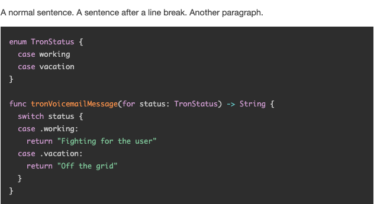
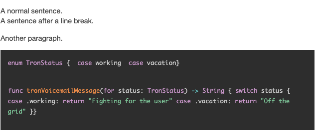
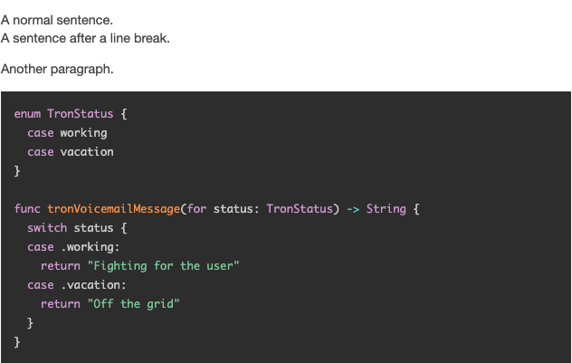

# linebreaks_ignoring_pre

A [Django](https://www.djangoproject.com/) template tag to replace line breaks (`\n`) in plain text with appropriate HTML 
(`<p>` or `<br>`), ignoring `<pre>...</pre>` elements.

## Usage

1. Copy the contents of "blog_templatetags.py" to where you want to define the new tag. Example project structure:
    ```
    blog
    |-migrations
    |-templates
    |-templatetags
      |-__init__.py
      |-blog_templatetags.py
    __init__.py
    ...
    ```

2. In your template, e.g. "post_detail.html":

    Load the template tag:      
    
    ```
    
    ```  

    Apply it to some content:
    
    ```
    <p>{{ post.content | linebreaks_ignoring_pre | safe }}</p>
    ```

## Example

This template tag is similar to the built-in "linebreaks" tag. The issue with the built-in tag is that is converts 
line breaks (`\r\n`, `\r`) everywhere, including inside `<pre>` elements. This behavior can break the presentation of 
`<pre>` elements when using certain syntax highlighters such as [Prism.js](https://prismjs.com/), since we're expecting
conventional line breaks there, instead of `<p>` or `<br>` html elements.

As an example, let's suppose we have an instance of a "Post" model with a content property of type "TextField". 

Our post's content can include both text and code and we're using Prism.js for syntax highlighting.

Using the admin interface, we add some text to our post's content field resulting in the following string being stored 
in the database:

```
'A normal sentence.\r\nA sentence after a line break.\r\n\r\nAnother paragraph.\r\n\r\n<pre><code class="language-swift">enum TronStatus {\r\n  case working\r\n  case vacation\r\n}\r\n\r\nfunc tronVoicemailMessage(for status: TronStatus) -> String {\r\n  switch status {\r\n  case .working:\r\n    return "Fighting for the user"\r\n  case .vacation:\r\n    return "Off the grid"\r\n  }\r\n}\r\n</code></pre>'
```

Now we want to diplay our post in a "post_detail.html" template:

1. Simply dislaying "content" does not convert line breaks into the appropriate html elements, causing text to appear
all in one line:

    ```
    <p>{{ post.content | safe }}</p>
    ```
    

2. Using the built-in "linebreaks" tag fixes the layout for normal text but messes with code styling:

    ```
    <p>{{ post.content | safe | linebreaks }}</p>
    ```
    

3. Using the "linebreaks_ignoring_pre" tag correctly displays both normal text and code:

    ```
    <p>{{ post.content | linebreaks_ignoring_pre | safe }}</p>
    ```
    

## License

This project is licensed under the MIT License - see the [LICENSE.txt](LICENSE.txt) file for details.

